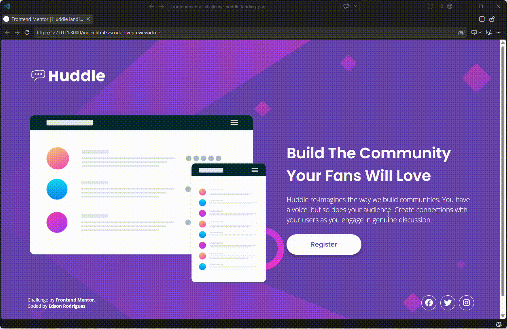

# Frontend Mentor - Solução da página inicial do Huddle com seção introdutória

Esta é uma solução para o desafio [Huddle landing page with a single introductory section no Frontend Mentor](https://www.frontendmentor.io/challenges/huddle-landing-page-with-a-single-introductory-section-B_2Wvxgi0). Os desafios do Frontend Mentor ajudam você a aprimorar suas habilidades de programação criando projetos realistas.

## Índice

* [Visão geral](#visão-geral)

  * [O desafio](#o-desafio)
  * [Screenshot](#screenshot)
  * [Links](#links)
* [Meu processo](#meu-processo)

  * [Tecnologias utilizadas](#tecnologias-utilizadas)
  * [O que aprendi](#o-que-aprendi)
  * [Desenvolvimento contínuo](#desenvolvimento-contínuo)
  * [Colaboração com IA](#colaboração-com-ia)
* [Autor](#autor)
* [Agradecimentos](#agradecimentos)

## Visão geral

### O desafio

Os usuários devem ser capazes de:

* Visualizar o layout ideal da página de acordo com o tamanho da tela do dispositivo.
* Visualizar os estados de `hover` de todos os elementos interativos da página.

### Screenshot



### Links

* **URL da solução:** [Acesse aqui](https://github.com/werneckx/frontendmentor-challenge-huddle-landing-page)
* **URL do site publicado:** [Acesse aqui](https://werneckx.github.io/frontendmentor-challenge-huddle-landing-page/)

## Meu processo

### Tecnologias utilizadas

* HTML5 semântico
* Propriedades personalizadas do CSS (CSS Custom Properties)
* Flexbox
* CSS Grid
* Abordagem responsiva
* Font Awesome
* Google Fonts

### O que aprendi

Durante o desenvolvimento deste projeto, pude reforçar conceitos importantes de HTML e CSS, principalmente relacionados à criação de layouts responsivos e à organização do código.

Um dos principais aprendizados foi a utilização do **CSS Grid** para estruturar o conteúdo principal da página, permitindo organizar a ilustração e a seção de informações de forma responsiva.

Também aprofundei meu conhecimento sobre **Flexbox**, utilizando-o para alinhar e distribuir elementos como o botão e os ícones das redes sociais.

Outro conceito importante foi o uso de `aspect-ratio` para garantir que os ícones das redes sociais permanecessem perfeitamente circulares:

```css
.footer .social-media .icon {
  width: 4rem;
  aspect-ratio: 1 / 1;
  border-radius: 50%;
}
```

Também trabalhei com **media queries** para adaptar o layout a diferentes tamanhos de tela e com estados `:hover` para melhorar a interação e a acessibilidade.

### Desenvolvimento contínuo

Nos próximos projetos, pretendo continuar aprimorando meus conhecimentos em:

* Responsividade e criação de layouts adaptáveis.
* CSS Grid e Flexbox.
* Acessibilidade na construção de interfaces.
* Boas práticas de HTML semântico.
* Organização e manutenção de CSS.
* Animações e transições utilizando CSS.
* Desenvolvimento de interfaces seguindo fielmente os designs fornecidos.

### Colaboração com IA

Durante o desenvolvimento deste projeto, utilizei ferramentas de **Inteligência Artificial**, principalmente o ChatGPT, como apoio ao processo de desenvolvimento.

A IA foi utilizada para:

* Esclarecer dúvidas sobre HTML e CSS.
* Entender melhor conceitos como `Grid`, `Flexbox` e `aspect-ratio`.
* Identificar possíveis problemas de responsividade.
* Revisar e melhorar a organização do CSS.
* Discutir boas práticas de acessibilidade.
* Auxiliar na identificação e correção de problemas durante o desenvolvimento.

A utilização da IA foi feita como uma ferramenta de **aprendizado e apoio**, buscando compreender os conceitos e as decisões por trás das soluções, em vez de simplesmente copiar o código gerado.

## Autor

* **GitHub:** [@werneckx](https://github.com/werneckx)
* **LinkedIn:** [Edson Rodrigues](https://www.linkedin.com/in/edson-rodrigues-5a1a46345/)
* **Frontend Mentor:** [@werneckx](https://www.frontendmentor.io/profile/werneckx)

## Agradecimentos

Agradeço ao **Frontend Mentor** pela oportunidade de praticar desenvolvimento front-end por meio de desafios baseados em projetos reais.

Também agradeço às ferramentas de documentação e à comunidade de desenvolvimento que contribuíram para o aprendizado e a resolução de dúvidas durante a construção deste projeto.
